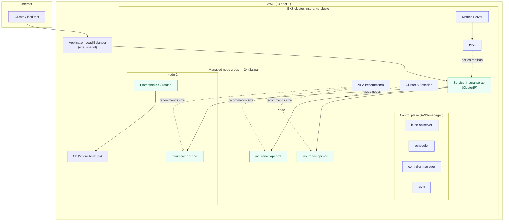

# Insurance-Premium Inference Platform on Kubernetes (EKS)

A production-style Kubernetes platform that runs a machine-learning inference
service on Amazon EKS — with horizontal and vertical autoscaling, node
autoscaling, consolidated L7 ingress, a full metrics stack, right-sizing, and
disaster-recovery backups. The ML service is the *workload*. The point of this
repository is the **platform** around it — the layer that keeps that workload
available, right-sized, and observable while load changes underneath it.

[](.github/workflows/deploy.yml)
[](https://kubernetes.io/)
[](https://hub.docker.com/r/tweakster24/insurance-premium-api)
[](https://prometheus.io/)
[](https://grafana.com/)
[](LICENSE)

---

## The problem this platform solves

An ML inference endpoint is not "done" the moment the container runs. In
production it has to survive the things that actually take services down —
and each of those pressures maps to a specific piece of this platform:

| Real-world pressure | What breaks without a platform | How this repo addresses it |
|---|---|---|
| **Traffic is spiky** — inference load arrives in bursts | A fixed replica count is wasteful at idle and overwhelmed at peak | **HPA** scales replicas on live CPU (2 → 10) |
| **Right-sizing is unknown up front** | Guessed CPU/memory requests waste money or trigger OOM kills | **VPA + Goldilocks** measure real usage and recommend requests |
| **Pods need machines** | The HPA wants more pods, but every node is full → pods stuck `Pending` | **Cluster Autoscaler** grows and shrinks the node group |
| **A load balancer per service is expensive** | N services → N cloud load balancers → N bills | **Ingress + one shared ALB** routes by path |
| **You can't fix what you can't see** | Latency, error-rate, and OOM regressions slip by silently | **Prometheus + Grafana** store and visualize the time series |
| **Clusters and their config get lost** | Namespaces, RBAC, and Ingress rebuilt by hand after a loss | **Velero** backs up cluster state to S3 daily |
| **A bad image reaching prod** | A broken build takes the live service down | **CI** smoke-tests `/health` + `/predict` before any deploy |

The design philosophy throughout is **measure, then decide.** Node specs alone
never tell you the right pod size or replica count — only real traffic does.
That is precisely why the autoscaling and observability layers exist here
instead of a hand-tuned static config that is stale the day it ships.

---

## Platform architecture



> Larger, layer-by-layer diagrams live in [docs/diagrams/](docs/diagrams/) —
> request lifecycle, autoscaling decision flow, scheduling, control-plane
> interaction, the monitoring pipeline, and more.

---

## The stack at a glance

| Layer | Component | Role | Manifest / values |
|---|---|---|---|
| Workload | Deployment + Service | 2+ replicas of the inference API behind a stable ClusterIP | [`k8s/base/`](k8s/base/) |
| Horizontal scaling | HorizontalPodAutoscaler | Replicas by live CPU (target 50%, 2 → 10) | [`k8s/autoscaling/hpa.yaml`](k8s/autoscaling/hpa.yaml) |
| Right-sizing | VerticalPodAutoscaler | Recommends requests (advice-only, `updateMode: Off`) | [`k8s/autoscaling/vpa.yaml`](k8s/autoscaling/vpa.yaml) |
| Node scaling | Cluster Autoscaler | Grows and shrinks the EC2 node group | [`k8s/autoscaling/cluster-autoscaler-values.yaml`](k8s/autoscaling/cluster-autoscaler-values.yaml) |
| Edge | Ingress + AWS LB Controller | One shared ALB, L7 path routing | [`k8s/ingress/`](k8s/ingress/) |
| Metrics | kube-prometheus-stack | Prometheus (internal) + Grafana (LoadBalancer) | [`k8s/observability/kube-prometheus-stack-values.yaml`](k8s/observability/kube-prometheus-stack-values.yaml) |
| Right-sizing UI | Goldilocks | Renders VPA recommendations | [`k8s/observability/goldilocks-values.yaml`](k8s/observability/goldilocks-values.yaml) |
| DR | Velero | Daily backup of cluster state to S3 | [`k8s/backup/velero-schedule.yaml`](k8s/backup/velero-schedule.yaml) |
| Delivery | GitHub Actions | Smoke-test the validated image, then deploy | [`.github/workflows/deploy.yml`](.github/workflows/deploy.yml) |

**Validated image:** `tweakster24/insurance-premium-api:latest` — the single
image used across every layer above (Deployments, Service, LoadBalancer, HPA,
VPA, Prometheus, Grafana, Goldilocks, Ingress, load testing). Pinning one
validated image means a fresh clone reproduces the deployment with no
image-related drift or surprises.

---

## Documentation map

| Area | What's inside |
|---|---|
| [docs/architecture/](docs/architecture/) | Design rationale, request lifecycle, control-plane interaction |
| [docs/kubernetes/](docs/kubernetes/) | **Every K8s object explained — what it is and *why* it exists** |
| [docs/kubernetes/DESIGN_DECISIONS.md](docs/kubernetes/DESIGN_DECISIONS.md) | Production design decisions with trade-offs (why replicas=2, why HPA 50%, why ALB over NodePort, …) |
| [docs/monitoring/](docs/monitoring/) | Prometheus/Grafana architecture, the metrics pipeline, alerting |
| [docs/runbooks/](docs/runbooks/) | Step-by-step incident response (scaling, rollback, pod failures, node loss, …) |
| [docs/debugging/](docs/debugging/) | `kubectl` diagnostic playbook — what each command reveals during an incident |
| [docs/operations/](docs/operations/) | Daily / weekly / monthly health checks, DR, backup and restore |
| [docs/performance/](docs/performance/) | Load testing, autoscaling behaviour, resource optimization |
| [docs/security/](docs/security/) | IAM/IRSA least-privilege, RBAC, secrets, container hardening |
| [docs/diagrams/](docs/diagrams/) | The full set of large Mermaid diagrams |
| [docs/APP_README.md](docs/APP_README.md) | The original application README (the ML service itself) |

---

## Quick start

```bash
# 0. Prereqs: an EKS cluster (see docs/operations for eksctl / Terraform),
#    kubectl, helm, and the Metrics Server installed.

# 1. Core workload
kubectl apply -k k8s/base

# 2. Horizontal autoscaling
kubectl apply -f k8s/autoscaling/hpa.yaml

# 3. Ingress (requires the AWS Load Balancer Controller — see k8s/ingress/)
kubectl apply -f k8s/ingress/ingress.yaml

# 4. Observability (Helm)
helm upgrade --install monitoring prometheus-community/kube-prometheus-stack \
  -n monitoring --create-namespace -f k8s/observability/kube-prometheus-stack-values.yaml

# 5. Verify
kubectl get pods,svc,hpa
kubectl top pods
```

Prefer to see it run before touching a cluster? The same validated image runs
locally with one command:

```bash
docker run -p 8000:8000 tweakster24/insurance-premium-api:latest
# then open http://localhost:8000/docs
```

---

## Screenshots

Drop real captures into [docs/images/](docs/images/) and they render here.

| View | File |
|---|---|
| Grafana cluster dashboard | `docs/images/grafana-dashboard.png` |
| Prometheus targets | `docs/images/prometheus-targets.png` |
| Goldilocks right-sizing | `docs/images/goldilocks.png` |
| HPA scaling under load | `docs/images/hpa-scaling.png` |
| `kubectl get pods` during a scale-out | `docs/images/kubectl-pods.png` |
| ALB / LoadBalancer address | `docs/images/loadbalancer.png` |

---

## Scope & honesty notes

This section states plainly what the platform does and does not do today, so the
manifests and the claims never drift apart:

- The service exposes `/health` and `/predict`. It does **not** yet expose a
  `/metrics` endpoint — cluster, node, and pod metrics flow via node-exporter
  and kube-state-metrics today, and app-level request metrics light up the
  moment the app adds an instrumentator (the `ServiceMonitor` is already wired
  for exactly that).
- The Helm `*-values.yaml` files contain placeholders (`<ACCOUNT_ID>`,
  `<VPC_ID>`, IRSA role ARNs) that are environment-specific by design.
- `grafana admin/admin123` and other convenience defaults are flagged in
  [docs/security/](docs/security/) as items to harden before any public exposure.

Nothing here claims a capability the manifests don't implement.
