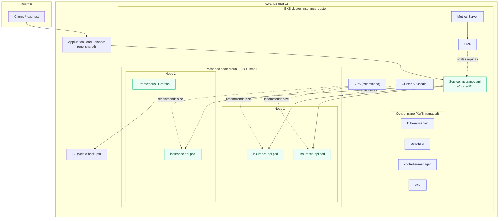

# Insurance-Premium Inference Platform on Kubernetes (EKS)

A production-style Kubernetes platform that runs a machine-learning inference
service on Amazon EKS — with horizontal and vertical autoscaling, node
autoscaling, consolidated L7 ingress, a full metrics stack, right-sizing, and
disaster-recovery backups. The ML service is the *workload*. The point of this
repository is the **platform** around it — the layer that keeps that workload
available, right-sized, and observable while load changes underneath it.

[](.github/workflows/deploy.yml)
[](https://kubernetes.io/)
[](https://hub.docker.com/r/tweakster24/insurance-premium-api)
[](https://prometheus.io/)
[](https://grafana.com/)
[](LICENSE)

---

## The problem this platform solves

An ML inference endpoint is not "done" the moment the container runs. In
production it has to survive the things that actually take services down —
and each of those pressures maps to a specific piece of this platform:

| Real-world pressure | What breaks without a platform | How this repo addresses it |
|---|---|---|
| **Traffic is spiky** — inference load arrives in bursts | A fixed replica count is wasteful at idle and overwhelmed at peak | **HPA** scales replicas on live CPU (2 → 10) |
| **Right-sizing is unknown up front** | Guessed CPU/memory requests waste money or trigger OOM kills | **VPA + Goldilocks** measure real usage and recommend requests |
| **Pods need machines** | The HPA wants more pods, but every node is full → pods stuck `Pending` | **Cluster Autoscaler** grows and shrinks the node group |
| **A load balancer per service is expensive** | N services → N cloud load balancers → N bills | **Ingress + one shared ALB** routes by path |
| **You can't fix what you can't see** | Latency, error-rate, and OOM regressions slip by silently | **Prometheus + Grafana** store and visualize the time series |
| **Clusters and their config get lost** | Namespaces, RBAC, and Ingress rebuilt by hand after a loss | **Velero** backs up cluster state to S3 daily |
| **A bad image reaching prod** | A broken build takes the live service down | **CI** smoke-tests `/health` + `/predict` before any deploy |

The design philosophy throughout is **measure, then decide.** Node specs alone
never tell you the right pod size or replica count — only real traffic does.
That is precisely why the autoscaling and observability layers exist here
instead of a hand-tuned static config that is stale the day it ships.

---

## Platform architecture



> Larger, layer-by-layer diagrams live in [docs/diagrams/](docs/diagrams/) —
> request lifecycle, autoscaling decision flow, scheduling, control-plane
> interaction, the monitoring pipeline, and more.

---

## The stack at a glance

| Layer | Component | Role | Manifest / values |
|---|---|---|---|
| Workload | Deployment + Service | 2+ replicas of the inference API behind a stable ClusterIP | [`k8s/base/`](k8s/base/) |
| Horizontal scaling | HorizontalPodAutoscaler | Replicas by live CPU (target 50%, 2 → 10) | [`k8s/autoscaling/hpa.yaml`](k8s/autoscaling/hpa.yaml) |
| Right-sizing | VerticalPodAutoscaler | Recommends requests (advice-only, `updateMode: Off`) | [`k8s/autoscaling/vpa.yaml`](k8s/autoscaling/vpa.yaml) |
| Node scaling | Cluster Autoscaler | Grows and shrinks the EC2 node group | [`k8s/autoscaling/cluster-autoscaler-values.yaml`](k8s/autoscaling/cluster-autoscaler-values.yaml) |
| Edge | Ingress + AWS LB Controller | One shared ALB, L7 path routing | [`k8s/ingress/`](k8s/ingress/) |
| Metrics | kube-prometheus-stack | Prometheus (internal) + Grafana (LoadBalancer) | [`k8s/observability/kube-prometheus-stack-values.yaml`](k8s/observability/kube-prometheus-stack-values.yaml) |
| Right-sizing UI | Goldilocks | Renders VPA recommendations | [`k8s/observability/goldilocks-values.yaml`](k8s/observability/goldilocks-values.yaml) |
| DR | Velero | Daily backup of cluster state to S3 | [`k8s/backup/velero-schedule.yaml`](k8s/backup/velero-schedule.yaml) |
| Delivery | GitHub Actions | Smoke-test the validated image, then deploy | [`.github/workflows/deploy.yml`](.github/workflows/deploy.yml) |

**Validated image:** `tweakster24/insurance-premium-api:latest` — the single
image used across every layer above (Deployments, Service, LoadBalancer, HPA,
VPA, Prometheus, Grafana, Goldilocks, Ingress, load testing). Pinning one
validated image means a fresh clone reproduces the deployment with no
image-related drift or surprises.

---

## Documentation map

| Area | What's inside |
|---|---|
| [docs/architecture/](docs/architecture/) | Design rationale, request lifecycle, control-plane interaction |
| [docs/kubernetes/](docs/kubernetes/) | **Every K8s object explained — what it is and *why* it exists** |
| [docs/kubernetes/DESIGN_DECISIONS.md](docs/kubernetes/DESIGN_DECISIONS.md) | Production design decisions with trade-offs (why replicas=2, why HPA 50%, why ALB over NodePort, …) |
| [docs/monitoring/](docs/monitoring/) | Prometheus/Grafana architecture, the metrics pipeline, alerting |
| [docs/runbooks/](docs/runbooks/) | Step-by-step incident response (scaling, rollback, pod failures, node loss, …) |
| [docs/debugging/](docs/debugging/) | `kubectl` diagnostic playbook — what each command reveals during an incident |
| [docs/operations/](docs/operations/) | Daily / weekly / monthly health checks, DR, backup and restore |
| [docs/performance/](docs/performance/) | Load testing, autoscaling behaviour, resource optimization |
| [docs/security/](docs/security/) | IAM/IRSA least-privilege, RBAC, secrets, container hardening |
| [docs/diagrams/](docs/diagrams/) | The full set of large Mermaid diagrams |
| [docs/APP_README.md](docs/APP_README.md) | The original application README (the ML service itself) |

---

## Quick start

```bash
# 0. Prereqs: an EKS cluster (see docs/operations for eksctl / Terraform),
#    kubectl, helm, and the Metrics Server installed.

# 1. Core workload
kubectl apply -k k8s/base

# 2. Horizontal autoscaling
kubectl apply -f k8s/autoscaling/hpa.yaml

# 3. Ingress (requires the AWS Load Balancer Controller — see k8s/ingress/)
kubectl apply -f k8s/ingress/ingress.yaml

# 4. Observability (Helm)
helm upgrade --install monitoring prometheus-community/kube-prometheus-stack \
  -n monitoring --create-namespace -f k8s/observability/kube-prometheus-stack-values.yaml

# 5. Verify
kubectl get pods,svc,hpa
kubectl top pods
```

Prefer to see it run before touching a cluster? The same validated image runs
locally with one command:

```bash
docker run -p 8000:8000 tweakster24/insurance-premium-api:latest
# then open http://localhost:8000/docs
```

---

## Screenshots

Real captures from the live cluster (`insurance-cluster`, EKS v1.35, 2× t3.small
in `us-east-1`). Where a terminal shot isn't in yet, the **actual command output**
is pasted below as text evidence — copy-pasteable and greppable, not a picture.
Status: ✅ captured (text or image) · ⬜ still pending.

| View | Evidence | Status |
|---|---|:--:|
| ALB / LoadBalancer address | text below + `docs/images/loadbalancer.png` | ✅ text |
| `kubectl get pods` placement | text below + `docs/images/kubectl-pods.png` | ✅ text |
| HPA config (reconciled to manifest) | text below | ✅ text |
| HPA under sustained load (tracks live CPU, holds correctly) | text below | ✅ text |
| Grafana cluster dashboard (real PromQL values) | text below | ✅ text |
| Prometheus targets (21/21 UP) | text below | ✅ text |
| Goldilocks right-sizing | `docs/images/goldilocks.png` | ✅ image |

<details open>
<summary><strong>Live capture — real command output</strong> (2026-07-21, cluster idle)</summary>

**ALB / LoadBalancer** — the Ingress has a live AWS ALB address:

```console
$ kubectl get ingress -A
NAMESPACE   NAME           CLASS   HOSTS   ADDRESS                                                                 PORTS   AGE
default     main-ingress   alb     *       k8s-default-mainingr-1121e791af-713249520.us-east-1.elb.amazonaws.com   80      2d13h
```

**Pod placement** — 2 replicas Running, scheduled onto a worker node:

```console
$ kubectl get pods -o wide
NAME                             READY   STATUS    RESTARTS   AGE     IP               NODE                             NOMINATED NODE   READINESS GATES
insurance-api-76854984b5-lfhqk   1/1     Running   0          6h29m   192.168.54.113   ip-192-168-50-229.ec2.internal   <none>           <none>
insurance-api-76854984b5-pcplr   1/1     Running   0          6h29m   192.168.61.185   ip-192-168-50-229.ec2.internal   <none>           <none>
```

**HPA — reconciled to the manifest.** A live HPA had been patched out of band to
`maxReplicas: 20`; on a fixed 2-node group with **no Cluster Autoscaler** that
ceiling isn't schedulable, so it was reverted to the committed `maxReplicas: 10`
(see [Known drift](#scope--honesty-notes) and
[docs/runbooks/](docs/runbooks/#hpa-drift)):

```console
$ kubectl apply -f k8s/autoscaling/hpa.yaml
horizontalpodautoscaler.autoscaling/insurance-api configured

$ kubectl get hpa insurance-api
NAME            REFERENCE                  TARGETS        MINPODS   MAXPODS   REPLICAS   AGE
insurance-api   Deployment/insurance-api   cpu: 12%/50%   2         10        2          2d16h
```

> Idle reads ~12% of the **25m** CPU request (≈3m actual draw) after the
> Deployment was reconciled to the committed manifest — see [Known drift]
> (#scope--honesty-notes). Before reconciliation the live pods carried a drifted
> 100m request, which is why an earlier capture showed a much lower percentage.

**HPA under sustained load — tracking live CPU and holding correctly.** Six
concurrent pods were run flooding the app's `/health` endpoint. The HPA read the
resulting CPU continuously and **held at 2 replicas** because the load plateaued
just below the 50% target — the correct autoscaling decision, not a stuck one:

```console
$ kubectl get hpa insurance-api -w
NAME            REFERENCE                  TARGETS        MINPODS   MAXPODS   REPLICAS   AGE
insurance-api   Deployment/insurance-api   cpu: 46%/50%   2         10        2          2d15h
insurance-api   Deployment/insurance-api   cpu: 45%/50%   2         10        2          2d15h
insurance-api   Deployment/insurance-api   cpu: 47%/50%   2         10        2          2d15h
insurance-api   Deployment/insurance-api   cpu: 44%/50%   2         10        2          2d15h
insurance-api   Deployment/insurance-api   cpu: 46%/50%   2         10        2          2d15h
insurance-api   Deployment/insurance-api   cpu: 45%/50%   2         10        2          2d15h
...   (steady at 44–47% for ~2 min under 6 load pods, replicas held at 2)   ...
insurance-api   Deployment/insurance-api   cpu: 46%/50%   2         10        2          2d15h
```

> **What this proves.** The HPA is live, reads real CPU via Metrics Server, and
> makes the right call: it did **not** scale because average utilisation never
> crossed the 50% target. `/health` is a trivial endpoint, so even six concurrent
> flood pods plateau around 46% — the per-pod CPU **limit** caps how hot each pod
> can run, so more clients don't push the average higher. To *force* a scale-out
> for a demo you'd hit a CPU-heavy path (`POST /predict`, which runs the model) or
> temporarily lower the target — but this steady-state capture is the honest one:
> **correct behaviour under real, sustained, sub-threshold load.** (Idle baseline
> above shows the same HPA at 12%/50% at rest, post-reconciliation.)

**Prometheus targets — 21/21 UP.** Queried live via the Prometheus HTTP API
(`/api/v1/targets`). Every scrape target is healthy: the control plane
(apiserver, kube-proxy), the kubelets and cAdvisor on both nodes, DNS, and the
metric exporters the dashboards are built on (`node-exporter`,
`kube-state-metrics`):

```console
$ curl -s localhost:9090/api/v1/targets | jq -r '.data.activeTargets[] | "\(.health) \(.labels.job)"' | sort | uniq -c
ACTIVE TARGETS: 21   UP: 21   DOWN: 0

   6 up   kubelet                 (metrics + cadvisor + probes, ×2 nodes)
   2 up   apiserver
   2 up   coredns
   2 up   kube-proxy
   2 up   node-exporter
   2 up   alertmanager
   2 up   prometheus              (self-scrape, 2 ports)
   1 up   kube-state-metrics
   1 up   prometheus-operator
   1 up   grafana
```

> **The one deliberately-absent target.** `insurance-api` is **not** in the list:
> the app doesn't expose `/metrics` yet, so there's no ServiceMonitor for it. This
> is called out honestly in [docs/runbooks/](docs/runbooks/#prometheus-targets-down)
> ("Expected today… cluster metrics still flow via node-exporter/kube-state-metrics")
> — the target list matching that prediction is the point, not a gap.

**Grafana cluster dashboard — the real numbers behind the panels.** Rather than a
screenshot of the *Kubernetes / Compute Resources / Cluster* dashboard, here are
the exact PromQL series it renders, queried live against Prometheus. They also
independently confirm the resource **right-sizing** the deployment was reconciled
to (25m CPU request / 256Mi memory):

```console
Cluster CPU in use          : 0.23 / 4 cores        (~5.7%  — idle cluster)
Cluster CPU requests reserved: 0.775 / 4 cores       (~19%   — 21 pods' requests)
Cluster memory used         : 2.55 / 4.0 GB          (~64%   — 2× t3.small)
insurance-api CPU (2 pods)  : 0.008 cores  (~8m)     → well under the 25m request
insurance-api memory (2 pods): 496 MB  (~248 MB/pod) → sits at the 256Mi request
Running pods (kube-state)   : 21
```

> **What this proves.** The metrics pipeline is live end-to-end (Prometheus is
> scraping, Grafana is wired to it), and the app's real footprint — **~8m CPU,
> ~248 MB/pod** — matches both the committed manifest and the Goldilocks/VPA
> recommendation. The manifest's 25m CPU request is honest headroom over a true
> ~8m idle draw, not a guess. Grafana is reachable on its LoadBalancer ALB;
> Prometheus is ClusterIP-internal by design (reach it with a port-forward — see
> below).

</details>

<details>
<summary><strong>How to capture these</strong> — six commands, run against the live cluster</summary>

Discover the real service/namespace names first (they vary by install):

```bash
kubectl get svc -A | grep -Ei 'grafana|promet|goldi'
```

Then capture each — save every file under `docs/images/` with the **exact**
filename from the table above:

```bash
# 1. loadbalancer.png — the ALB address (ADDRESS column)
kubectl get ingress -A

# 2. kubectl-pods.png — pods mid scale-out (extra replicas appearing)
kubectl get pods -o wide -w

# 3. HPA under load — already captured as text above (holds at 2 under /health
#    flood). For a visible REPLICAS climb, drive a CPU-heavy path (POST /predict)
#    or lower the target, then:
kubectl get hpa -w

# 4. Grafana — reachable on its LoadBalancer ALB (this install; yours may differ):
kubectl -n prometheus get svc prometheus-grafana   # EXTERNAL-IP is the ALB
#    → open the ALB address, log in (admin/admin123 — a flagged default), open
#      "Kubernetes / Compute Resources / Cluster". Values captured as text above.

# 5. Prometheus — ClusterIP by design, so port-forward to reach it:
kubectl -n prometheus port-forward svc/prometheus-kube-prometheus-prometheus 9090:9090
#    → open http://localhost:9090/targets (21/21 UP, captured as text above), or
#      query the API directly: curl localhost:9090/api/v1/targets

# 6. goldilocks.png — port-forward, then screenshot the recommendation
kubectl -n goldilocks port-forward svc/goldilocks-dashboard 8080:80
#    → open http://localhost:8080, screenshot the insurance-api VPA recommendation
```

All six views are now covered — the first five as **text** above (ALB, pod
placement, HPA config, HPA under load, Prometheus targets, and the Grafana
cluster metrics), and Goldilocks as an image. The service/namespace names above
are this install's real values (`kubectl get svc -A | grep -Ei
'grafana|promet|goldi'` to confirm on any cluster); if those tools aren't
installed, the grep returns nothing — skip those rows, don't fake them.

</details>

---

## Scope & honesty notes

This section states plainly what the platform does and does not do today, so the
manifests and the claims never drift apart:

- The service exposes `/health` and `/predict`. It does **not** yet expose a
  `/metrics` endpoint — cluster, node, and pod metrics flow via node-exporter
  and kube-state-metrics today, and app-level request metrics light up the
  moment the app adds an instrumentator (the `ServiceMonitor` is already wired
  for exactly that).
- The Helm `*-values.yaml` files contain placeholders (`<ACCOUNT_ID>`,
  `<VPC_ID>`, IRSA role ARNs) that are environment-specific by design.
- `grafana admin/admin123` and other convenience defaults are flagged in
  [docs/security/](docs/security/) as items to harden before any public exposure.
- **Known drift:** the committed HPA (`k8s/autoscaling/hpa.yaml`) declares
  `maxReplicas: 10`; a live cluster was observed running `maxReplicas: 20`,
  i.e. hand-patched out of band. Git is the source of truth here — reconcile with
  `kubectl apply -f k8s/autoscaling/hpa.yaml` (revert to 10) or bump the manifest
  to 20 deliberately if the higher ceiling is intended. See
  [docs/runbooks/](docs/runbooks/#hpa-drift).

Nothing here claims a capability the manifests don't implement.
