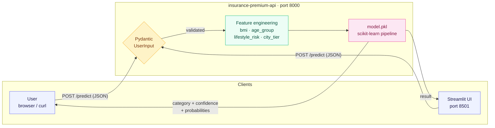
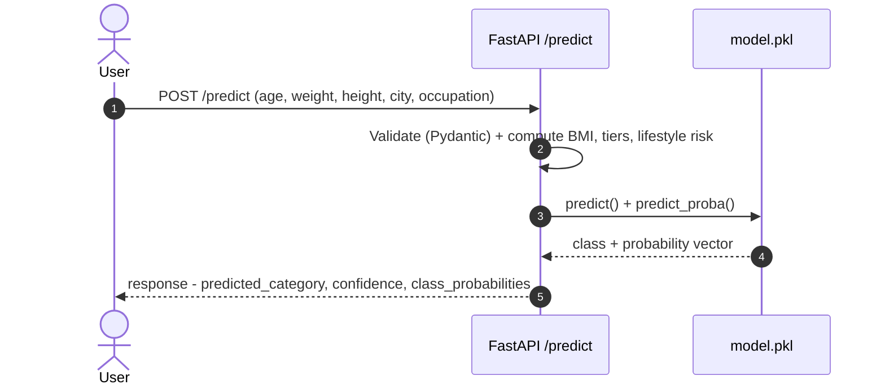
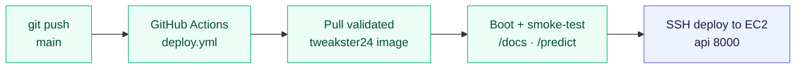

# 🏥 Insurance Premium Category Predictor

> An end-to-end **MLOps** project: a machine-learning model served behind a typed **FastAPI** API, packaged as an immutable **Docker** image, validated and shipped by a self-testing **GitHub Actions** pipeline, and deployed live to **AWS EC2** alongside a **Streamlit** UI.

It predicts an insurance **premium category** (`Low` / `Medium` / `High`) from a person's demographic and lifestyle profile, and returns a confidence score plus the full probability distribution, not just a bare label.

[](https://github.com/Amith-Ganta/FastAPI-ML-Docker-AWS/actions/workflows/deploy.yml)
[](https://hub.docker.com/r/tweakster24/insurance-premium-api)
[](https://www.python.org/downloads/)
[](https://fastapi.tiangolo.com/)
[](https://scikit-learn.org/)
[](LICENSE)

---

## 🔴 Live demo

The full stack is deployed and running on AWS right now:

| | URL | What it is |
|---|-----|------------|
| 🧠 **API (Swagger)** | **http://204.236.207.23:8000/docs** | Interactive API: send a live prediction from the browser |
| 🎨 **Streamlit UI** | **http://204.236.207.23:8501** | Friendly web form for non-technical users |

> *Demo instance on a single `t3.micro`, so please be gentle. If it's down, the 10-second local run below gives you the identical experience.*

---

## 🚀 Run it locally in 10 seconds

No clone, no build, no Python toolchain. The API ships as a ready-to-run image:

```bash
docker pull tweakster24/insurance-premium-api:latest
docker run -p 8000:8000 tweakster24/insurance-premium-api:latest
```

Then open **http://localhost:8000/docs** and try a live prediction:

```bash
curl -X POST http://localhost:8000/predict \
  -H "Content-Type: application/json" \
  -d '{"age":30,"weight":65,"height":1.7,"income_lpa":10,"smoker":true,"city":"Mumbai","occupation":"private_job"}'
```

```json
{
  "response": {
    "predicted_category": "Low",
    "confidence": 0.66,
    "class_probabilities": { "High": 0.01, "Low": 0.66, "Medium": 0.33 }
  }
}
```

---

## 🎯 What this project demonstrates

This repo is deliberately small in domain scope and deep in **engineering practice**. It's a portfolio piece for the part that's hard to fake: taking a model and making it a *reliable, reproducible, deployed service*.

| Competency | Where to see it |
|------------|-----------------|
| **API design**: typed, validated, self-documenting | [`backend/app.py`](backend/app.py) · Pydantic schema + auto OpenAPI at `/docs` |
| **Containerization**: single immutable artifact | [`backend/Dockerfile`](backend/Dockerfile) · one image runs anywhere |
| **CI/CD engineering**: self-validating pipeline | [`.github/workflows/deploy.yml`](.github/workflows/deploy.yml) · test-before-ship, guarded steps |
| **Cloud deployment**: automated SSH rollout to EC2 | deploy job → `204.236.207.23` · `--restart unless-stopped` |
| **Full-stack delivery**: UI wired to the service | [`frontend/frontend.py`](frontend/frontend.py) · Streamlit → API |
| **Reproducibility**: pinned deps, compose for local | [`docker-compose.yml`](docker-compose.yml) · local == prod |
| **ML serving done honestly**: probabilities, not just labels | `predict_proba` → confidence + full distribution |

---

## 🧱 Tech stack

| Layer | Technology |
|-------|-----------|
| API framework | FastAPI 0.115 · Uvicorn |
| ML framework | scikit-learn 1.6 (pinned for pickle compatibility) |
| Validation | Pydantic 2.11 |
| Data handling | pandas 2.2 |
| Packaging | Docker · Docker Compose |
| Registry | Docker Hub (`tweakster24/insurance-premium-api`) |
| CI/CD | GitHub Actions |
| Cloud | AWS EC2 (Ubuntu) |
| UI | Streamlit 1.43 |

---

## 🏗️ Architecture

### System overview



The core deliverable is a **stateless FastAPI container**: it validates the payload with Pydantic, derives the engineered features the model was trained on, and runs them through a pre-trained scikit-learn pipeline loaded from `model.pkl`. Any HTTP client works: `curl`, a notebook, another service, or the bundled Streamlit UI. Statelessness is deliberate: it makes the service horizontally scalable and trivially replaceable.

### Request lifecycle



### CI/CD pipeline: *test before you ship*



The pipeline's defining property: **a broken image can never reach production.** Every run boots the container and asserts the real `/docs` and `/predict` endpoints return the expected contract *before* anything is deployed. The deploy stage is **guarded**: if the AWS secrets aren't configured, it skips cleanly and the run stays green, so the pipeline is safe to run from a fork or before infra exists.

> **🔍 Image provenance.** The service runs the validated image `tweakster24/insurance-premium-api:latest`, the same artifact used throughout the Kubernetes/EKS deployment (Deployments, Service, LoadBalancer, HPA, VPA, Prometheus, Grafana, Goldilocks, Ingress, load testing). Pinning a single validated image means anyone cloning the project reproduces the deployment without image-related errors. This project's engineering contribution is the platform layer *around* the model: the API contract, the Kubernetes manifests, autoscaling, observability, and the self-validating CI/CD pipeline.

See [docs/ARCHITECTURE.md](docs/ARCHITECTURE.md) for the full design rationale.

---

## 🧠 Design decisions & trade-offs

The choices a reviewer would actually ask about, with the honest reasoning behind them.

| Decision | Why | Trade-off accepted |
|----------|-----|--------------------|
| **Immutable image as the unit of release** | The exact bytes tested in CI are the bytes that run in prod, so there's zero "works on my machine" drift. | No per-environment build flexibility; config must come in via env/runtime. |
| **`/docs` as the readiness probe** | Guaranteed to exist on any FastAPI app; no extra endpoint to maintain or drift. | Slightly heavier than a bare `/health`; fine at this scale. |
| **Guarded CI steps over hard dependencies** | Pipeline stays green on forks / before secrets exist; failures are *real* failures, not missing-config noise. | A misconfigured secret silently skips rather than shouting; this is documented in the deploy table. |
| **Return full probability distribution** | Lets consumers act on confidence and build thresholds, not just trust a top label. | Marginally larger payload; exposes model uncertainty (a feature, not a bug). |
| **Stateless service, no DB** | Horizontal scaling and restarts are free; nothing to back up. | No request audit trail yet (see roadmap). |
| **Streamlit for the UI** | Fastest path to a usable demo for non-technical reviewers. | Not a production frontend; it's a thin client over the API. |

---

## 📡 API reference

### `GET /docs`
Interactive Swagger UI. It's also the readiness probe used by Docker and the CI smoke tests. `GET /redoc` and `GET /openapi.json` are available too.

### `POST /predict`
Predict the insurance premium category for a user profile.

**Request body**

```json
{
  "age": 30,
  "weight": 65.0,
  "height": 1.75,
  "income_lpa": 10.0,
  "smoker": false,
  "city": "Mumbai",
  "occupation": "private_job"
}
```

| Field | Type | Constraints |
|-------|------|-------------|
| `age` | int | `0 < age < 120` |
| `weight` | float | `> 0` (kg) |
| `height` | float | `0 < height < 2.5` (m) |
| `income_lpa` | float | `> 0` (lakhs/yr) |
| `smoker` | bool | none |
| `city` | string | any city name |
| `occupation` | enum | `retired`, `freelancer`, `student`, `government_job`, `business_owner`, `unemployed`, `private_job` |

**Response** (`200 OK`)

```json
{
  "response": {
    "predicted_category": "Low",
    "confidence": 0.66,
    "class_probabilities": { "High": 0.01, "Low": 0.66, "Medium": 0.33 }
  }
}
```

Validation errors return `422` with a precise field-level reason. Full reference: [docs/API.md](docs/API.md).

---

## 🧮 The model & feature engineering

The classifier doesn't consume raw inputs. It learns on **engineered features** derived inside the API, so the same transformation logic is guaranteed at train and serve time:

| Engineered feature | Derived from |
|--------------------|--------------|
| `bmi` | weight / height² |
| `age_group` | young / adult / middle_aged / senior |
| `lifestyle_risk` | smoker status + BMI |
| `city_tier` | tier-1 / tier-2 / tier-3 lookup |
| `income_lpa`, `occupation` | passed through |

Output is a discrete premium category **plus a probability for every class**, so consumers can act on confidence rather than a single hard label.

---

## 🛠️ Local development

**Option A: just the API (fastest)**
```bash
docker pull tweakster24/insurance-premium-api:latest
docker run -p 8000:8000 tweakster24/insurance-premium-api:latest
# → http://localhost:8000/docs
```

**Option B: full stack with Docker Compose (API + UI)**
```bash
git clone https://github.com/Amith-Ganta/FastAPI-ML-Docker-AWS.git
cd FastAPI-ML-Docker-AWS
docker compose up --build
# API: http://localhost:8000/docs   ·   UI: http://localhost:8501
```

**Option C: bare metal (no Docker)**
```bash
cd backend && pip install -r requirements.txt && uvicorn app:app --reload --port 8000
# new terminal:
cd frontend && pip install -r requirements.txt && streamlit run frontend.py --server.port 8501
```

More in [docs/LOCAL_SETUP.md](docs/LOCAL_SETUP.md).

---

## 🚢 Deployment

CI/CD deploys automatically to AWS EC2 (`204.236.207.23`) on every push to `main`, once the secrets below are set. To deploy by hand anywhere, it's the same two commands on a laptop, VM, EC2, or any container platform:

```bash
docker pull tweakster24/insurance-premium-api:latest
docker run -d --name insurance-premium-api -p 8000:8000 \
  --restart unless-stopped tweakster24/insurance-premium-api:latest
```

Full playbook (EC2 setup, security groups, the Streamlit container) in [docs/DEPLOYMENT.md](docs/DEPLOYMENT.md).

### CI/CD secrets

| Secret | Used for | Example |
|--------|----------|---------|
| `DOCKER_USERNAME` | Docker Hub login | `tweakster24` |
| `DOCKER_TOKEN` | Docker Hub access token | `dckr_pat_…` |
| `AWS_HOST` | EC2 public IP for SSH deploy | `204.236.207.23` |
| `AWS_SSH_KEY` | EC2 private key (PEM contents) | `-----BEGIN …` |
| `AWS_USER` | EC2 SSH user *(optional, defaults to `ubuntu`)* | `ubuntu` |

Publish and deploy are independently guarded: set just the Docker secrets to publish; add the AWS secrets to also deploy.

---

## 🗺️ Production-readiness roadmap

Honest about what a *real* production rollout would add next, the gap between a portfolio demo and a system on call at 3 a.m.:

- **TLS + reverse proxy** (Caddy/Traefik): HTTPS, not raw `:8000`.
- **Authentication & rate limiting**: API keys, per-client quotas.
- **Observability**: structured logs, Prometheus metrics, request/latency tracing.
- **Horizontal scale**: multiple replicas behind a load balancer (the stateless design already allows this).
- **Model lifecycle**: a retraining pipeline, model registry, and versioned rollouts with A/B comparison.
- **Request audit store**: persist inputs/predictions for monitoring drift and debugging.
- **Hardening**: least-privilege SSH (lock port 22 to known IPs), rotated keys, secrets in a manager rather than plain GitHub secrets.

---

## 📁 Project structure

```
FastAPI-ML-Docker-AWS/
├── backend/                   # FastAPI service (the API source)
│   ├── app.py                 # validation · feature engineering · inference
│   ├── model.pkl              # trained scikit-learn pipeline
│   ├── Dockerfile
│   └── requirements.txt
├── frontend/                  # Streamlit UI (thin client over the API)
│   ├── frontend.py
│   ├── Dockerfile.streamlit
│   └── requirements.txt
├── .github/workflows/
│   └── deploy.yml             # CI/CD: resolve → smoke-test → publish → deploy
├── docs/                      # API · architecture · setup · deployment guides
├── docker-compose.yml         # full-stack local orchestration
├── LICENSE
└── README.md
```

---

## 🩹 Troubleshooting

```bash
# Port 8000 already in use
docker rm -f insurance-premium-api 2>/dev/null || true

# Inspect logs
docker logs insurance-premium-api

# Verify the service is up
curl -I http://localhost:8000/docs
```

---

## 📄 License

Released under the [MIT License](LICENSE). © 2026 Amith Ganta.

---

<p align="center"><i>Built to show what happens to a model <b>after</b> the notebook: the API, the image, the pipeline, and the box it runs on.</i></p>
