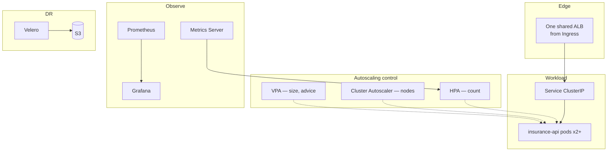

# Architecture

The design rationale for the platform, the end-to-end request lifecycle, and how
the control plane and worker nodes interact. This is the "why is it shaped this
way" document. The per-object reference lives in
[../kubernetes/COMPONENTS.md](../kubernetes/COMPONENTS.md), and the full visual
set is in [../diagrams/](../diagrams/).

---

## The one idea the whole platform is built on

> **You cannot derive the right runtime configuration from static specs. Only
> real traffic tells you the right replica count and pod size — so measure,
> then decide.**

Every layer is a direct consequence of that idea:

- Don't guess a replica count → **HPA** sets it from live CPU.
- Don't guess a pod size → **VPA + Goldilocks** measure and recommend it.
- Pods need machines you also can't pre-count → **Cluster Autoscaler**.
- You can't measure what you can't see → **Prometheus + Grafana**.
- You can't afford to lose the config you tuned → **Velero**.

The ML service is the *workload*. The platform is the part that keeps that
workload available, right-sized, and observable as load changes underneath it.

---

## Layered view

Read the dotted edges as "acts on": the HPA changes the pod *count*, the VPA
recommends each pod's *size*, and the Cluster Autoscaler adds the *nodes* those
pods land on. Three controllers, three non-overlapping dimensions — none of them
steps on another's decision.

---

## Request lifecycle (narrative)

1. A client hits the **ALB** (provisioned from the Ingress by the AWS Load
   Balancer Controller). The ALB has already dropped unhealthy targets via its
   health check on `/health`, so traffic only reaches pods that can serve it.
2. The ALB forwards to the **Service** (ClusterIP). The Service load-balances
   only across **Ready** pods — the `readinessProbe` decides membership, so a
   pod that is still warming up never receives a request.
3. **kube-proxy** DNATs the Service virtual IP to a concrete pod IP.
4. The **pod** (`uvicorn` on port 8000) runs the model in-memory and returns the
   prediction (`predicted_category` + confidence + class probabilities).
5. Throughout, the `liveness` and `readiness` probes run in parallel, and the
   **Metrics Server** samples CPU — the signal the **HPA** reads to decide
   whether to add or remove pods.

The step-by-step sequence diagram is
[diagram #1](../diagrams/README.md#1-request-lifecycle-client--prediction).

---

## Control-plane ⇄ node interaction

EKS runs the control plane (API server, scheduler, controller-manager, etcd) as
an AWS-managed, highly-available service for roughly \$0.10/hr. The pattern that
matters here:

> **Nothing issues imperative commands. Every component *watches* the API server
> and reconciles toward desired state.** `kubectl apply` only records intent in
> etcd; controllers and kubelets each notice the change and act independently.

That level-triggered, watch-and-reconcile model is exactly why the system
self-heals. A dead pod is not "recreated by a command" — the ReplicaSet
controller notices that reality has drifted from desired state and corrects it,
with no operator in the loop. See
[diagram #9](../diagrams/README.md#9-control-plane-interaction-what-happens-on-kubectl-apply).

---

## Why an EKS-managed control plane

Self-hosting etcd and the control plane is a full-time reliability job with a
large blast radius — a botched etcd upgrade or a lost quorum takes the whole
cluster with it. EKS trades a small hourly fee and some AWS coupling for an HA
control plane, managed patching, and a much smaller operational surface. For
anything beyond a throwaway local cluster, that is the right trade. The full
rationale and the alternatives considered are in
[../kubernetes/DESIGN_DECISIONS.md](../kubernetes/DESIGN_DECISIONS.md).

---

## Where the application ends and the platform begins

| Concern | Owned by | Lives in |
|---|---|---|
| Model, prediction logic, `/health`, `/predict` | The **app** (validated image) | [../APP_README.md](../APP_README.md) |
| Replicas, sizing, nodes, edge, metrics, DR | The **platform** | `k8s/` + these docs |

This separation is deliberate. The platform treats the image as an immutable,
validated black box and provides everything *around* it. That is why swapping the
app — or adding the `/metrics` endpoint — is an image change, not a platform
change: the manifests, autoscalers, and observability wiring stay exactly as they
are.
