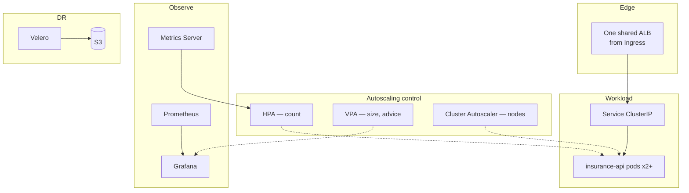

# Architecture

The design rationale for the platform, the end-to-end request lifecycle, and how
the control plane and worker nodes interact. This is the "why is it shaped this
way" document; the per-object reference is in
[../kubernetes/COMPONENTS.md](../kubernetes/COMPONENTS.md), and the visual set is
in [../diagrams/](../diagrams/).

---

## The one idea the whole platform is built on

> **You cannot derive the right runtime configuration from static specs. Only
> real traffic tells you the right replica count and pod size — so measure,
> then decide.**

Every layer is a consequence of that idea:

- Don't guess a replica count → **HPA** sets it from live CPU.
- Don't guess a pod size → **VPA + Goldilocks** measure and recommend it.
- Pods need machines you also can't pre-count → **Cluster Autoscaler**.
- You can't measure what you can't see → **Prometheus + Grafana**.
- You can't afford to lose the config you tuned → **Velero**.

The ML service is the *workload*; the platform is the part that keeps it
available, right-sized, and observable as load changes.

---

## Layered view

---

## Request lifecycle (narrative)

1. A client hits the **ALB** (provisioned from the Ingress by the AWS LB
   Controller). The ALB has already dropped unhealthy targets via its health
   check on `/health`.
2. The ALB forwards to the **Service** (ClusterIP). The Service load-balances
   only across **Ready** pods — `readinessProbe` decides membership.
3. **kube-proxy** DNATs the Service virtual IP to a concrete pod IP.
4. The **pod** (`uvicorn` on 8000) runs the model in-memory and returns
   `predicted_category`.
5. Throughout, `liveness`/`readiness` probes run in parallel; **Metrics Server**
   samples CPU, which the **HPA** reads to decide whether to add pods.

The step-by-step sequence diagram is
[diagram #1](../diagrams/README.md#1-request-lifecycle-client--prediction).

---

## Control-plane ⇄ node interaction

EKS runs the control plane (API server, scheduler, controller-manager, etcd) as
an AWS-managed, HA service for ~\$0.10/hr. The pattern that matters:

> **Nothing issues imperative commands. Every component *watches* the API server
> and reconciles toward desired state.** `kubectl apply` only records intent in
> etcd; controllers and kubelets each notice and act independently.

That level-triggered, watch-and-reconcile model is why the system self-heals: a
dead pod isn't "recreated by a command," it's the ReplicaSet controller noticing
reality drifted from desired state and correcting it. See
[diagram #9](../diagrams/README.md#9-control-plane-interaction-what-happens-on-kubectl-apply).

---

## Why EKS-managed control plane

Self-hosting etcd + the control plane is a full-time reliability job with a large
blast radius. EKS trades a small hourly fee and some AWS coupling for HA control
plane, patching, and a smaller operational surface — the right trade for anything
beyond a throwaway local cluster. Full rationale and the alternatives considered:
[../kubernetes/DESIGN_DECISIONS.md](../kubernetes/DESIGN_DECISIONS.md).

---

## Where the application ends and the platform begins

| Concern | Owned by | Lives in |
|---|---|---|
| Model, prediction logic, `/health`, `/predict` | The **app** (validated image) | [../APP_README.md](../APP_README.md) |
| Replicas, sizing, nodes, edge, metrics, DR | The **platform** | `k8s/` + these docs |

This separation is deliberate: the platform treats the image as an immutable,
validated black box and provides everything *around* it. That's why swapping the
app (or fixing `/metrics`) is an image change, not a platform change.
