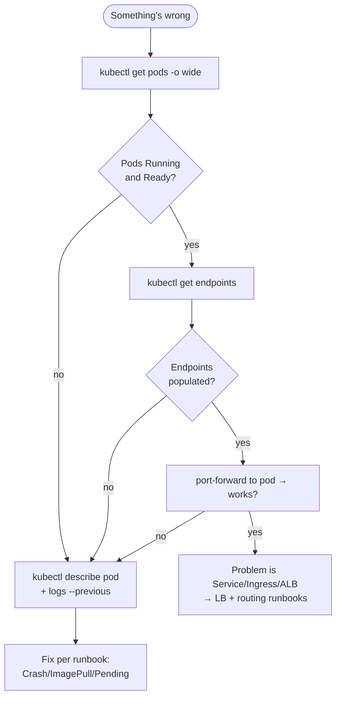

# kubectl debugging playbook

Not a command dump — *what each command tells you* and *when to reach for it*
during a real incident. Ordered by how often you'll actually use them.

---

## The four you'll use in 90% of incidents

### `kubectl get pods -o wide`
The state of the world. `-o wide` adds **NODE** and **IP** — essential for
"is this one node or the whole cluster?" Watch `STATUS` and `RESTARTS`.
```bash
kubectl get pods -o wide
kubectl get pods -w                 # stream changes live during a rollout
kubectl get pods -l app=insurance-api
```

### `kubectl describe <kind> <name>`
The **Events** section at the bottom is where Kubernetes tells you *why*. Failed
scheduling, image pull errors, probe failures, OOM kills — all here.
```bash
kubectl describe pod <pod>
kubectl describe node <node>        # Conditions + Allocated resources
kubectl describe hpa insurance-api  # scaling decisions + why
```

### `kubectl logs`
What the application itself said. `--previous` is the one people forget — it's
the logs of the *crashed* container, the only place the crash reason lives.
```bash
kubectl logs <pod>
kubectl logs <pod> --previous       # the container that just died
kubectl logs -f deploy/insurance-api
kubectl logs <pod> --since=10m
```

### `kubectl get events`
The cluster's activity feed, newest last. Great for "what just changed?"
```bash
kubectl get events --sort-by=.lastTimestamp
kubectl get events --field-selector type=Warning
```

---

## Routing & networking

### `kubectl get endpoints`
**The single fastest triage for a routing problem.** If a Service's endpoints
are empty, no pods are Ready behind it — it's a *pod-health* problem, not a
Service problem.
```bash
kubectl get endpoints insurance-api
kubectl get svc                     # types + EXTERNAL-IP / <pending>
kubectl describe ingress
```

### Confirm a Service actually reaches its pods
```bash
# Exec into any pod and curl the Service by DNS name
kubectl exec -it <pod> -- sh -c 'wget -qO- http://insurance-api/health || true'
# (image is slim — if no wget, run a throwaway debug pod:)
kubectl run tmp --rm -it --image=busybox --restart=Never -- \
  wget -qO- http://insurance-api.default.svc.cluster.local/health
```

---

## Resource & scaling

### `kubectl top`
Live CPU/memory (needs Metrics Server — the same source the HPA uses). If
`top` fails, the HPA is blind too.
```bash
kubectl top nodes
kubectl top pods
kubectl top pods --containers
```

### `kubectl get hpa` / rollout
```bash
kubectl get hpa insurance-api            # TARGETS shows current vs target %
kubectl rollout status deploy/insurance-api
kubectl rollout history deploy/insurance-api
```

---

## Get inside a running pod

```bash
kubectl exec -it <pod> -- sh              # a shell in the container
kubectl exec <pod> -- env                 # its environment
kubectl port-forward <pod> 8000:8000      # reach it locally, bypassing the LB
```

Bypassing layers is a debugging superpower: `port-forward` to the **pod** proves
the app works; if the pod is fine but external traffic 503s, the problem is the
Service/Ingress/ALB, not the app.

---

## Learn the API without leaving the terminal

```bash
kubectl explain deployment.spec.strategy      # field docs, inline
kubectl explain hpa.spec.metrics
kubectl api-resources                         # every kind + short name + apiGroup
kubectl get deploy insurance-api -o yaml      # the full live object
kubectl get deploy insurance-api -o jsonpath='{.spec.replicas}'
```

---

## A minimal triage flow



See [../runbooks/](../runbooks/) for the fix procedures each branch lands on.
