# Platform diagrams

Large Mermaid diagrams of every moving part. Each one answers a single "how does
*this* work?" question. They render natively on GitHub.

**Index**
1. [Request lifecycle](#1-request-lifecycle-client--prediction)
2. [Deployment / rollout flow](#2-deployment--rollout-flow)
3. [Kubernetes object hierarchy](#3-kubernetes-object-hierarchy)
4. [The three-layer autoscaling model](#4-the-three-layer-autoscaling-model)
5. [HPA decision loop](#5-hpa-decision-loop)
6. [VPA recommendation loop](#6-vpa-recommendation-loop)
7. [Cluster Autoscaler decision](#7-cluster-autoscaler-decision)
8. [Pod scheduling decision](#8-pod-scheduling-decision)
9. [Control-plane interaction](#9-control-plane-interaction-what-happens-on-kubectl-apply)
10. [Monitoring / metrics pipeline](#10-monitoring--metrics-pipeline)
11. [Ingress & load-balancer routing](#11-ingress--load-balancer-routing)
12. [Service networking (how a ClusterIP resolves to a pod)](#12-service-networking)
13. [Velero backup flow](#13-velero-backup-flow)
14. [CI/CD pipeline](#14-cicd-pipeline)

---

## 1. Request lifecycle (client → prediction)

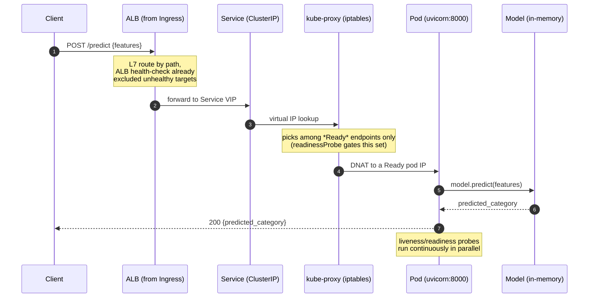

---

## 2. Deployment / rollout flow

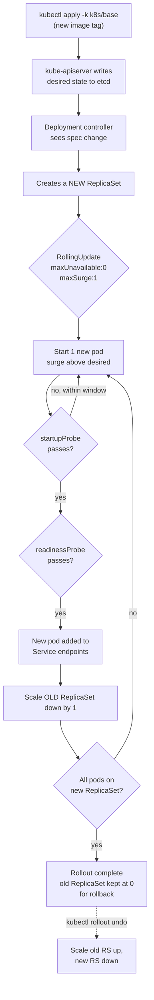

---

## 3. Kubernetes object hierarchy

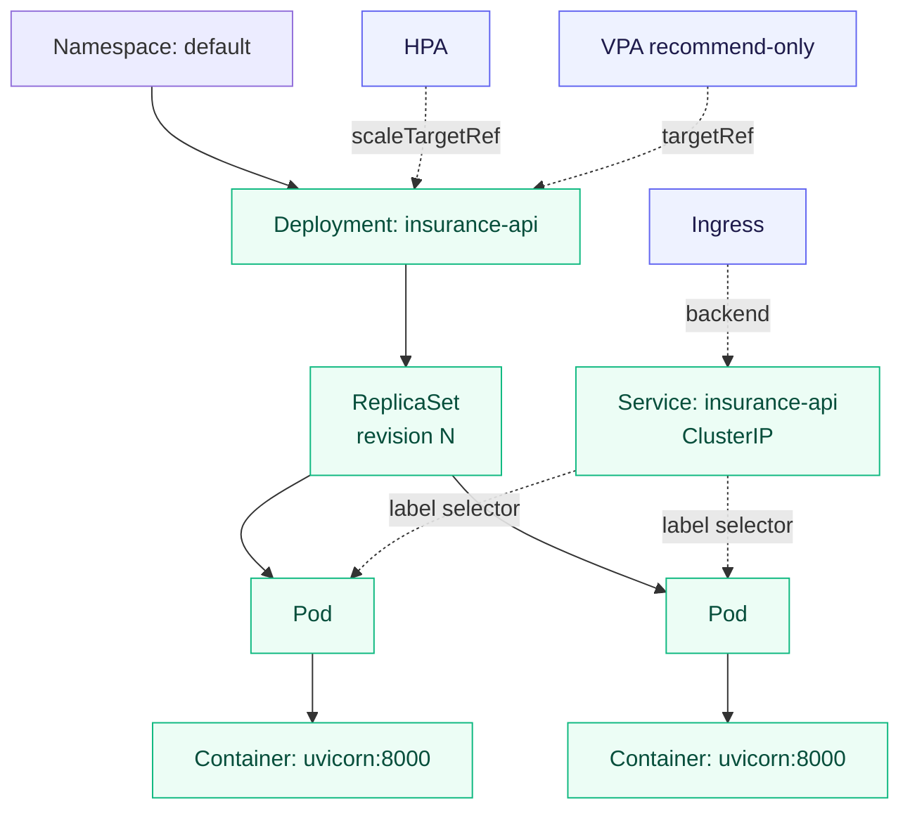

---

## 4. The three-layer autoscaling model

The single most important mental model in this repo: three controllers answering
three *different* questions, deliberately non-overlapping.

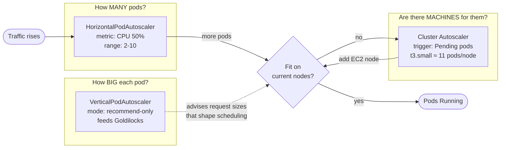

---

## 5. HPA decision loop

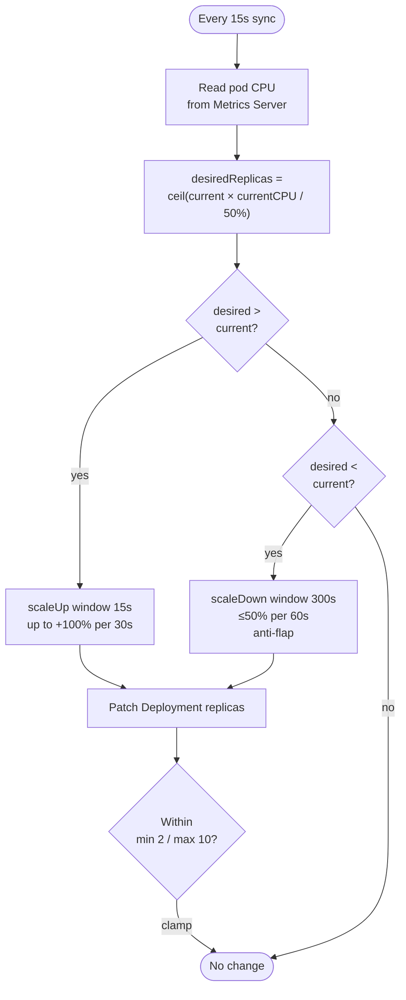

---

## 6. VPA recommendation loop

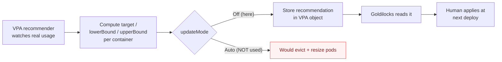

> `Auto` is drawn only to show the road *not* taken. On a 2-node cluster,
> eviction-to-resize is too disruptive, and it collides with the HPA on CPU.

---

## 7. Cluster Autoscaler decision

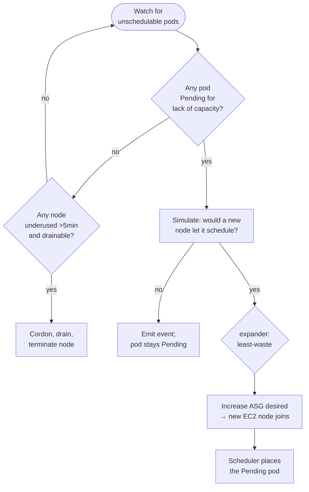

---

## 8. Pod scheduling decision

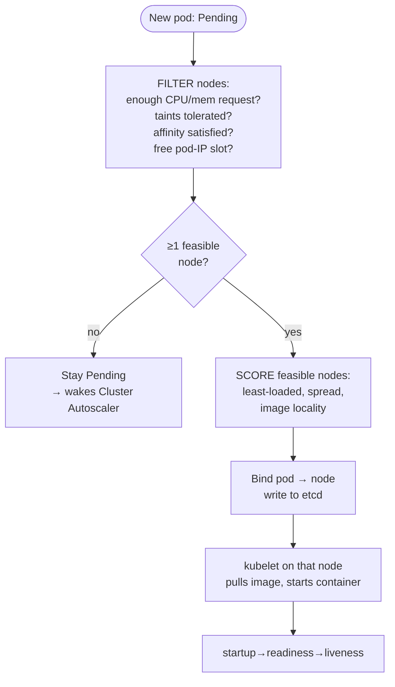

> The `FILTER` step keys on **requests**, not usage, which is exactly why the
> `25m`/`256Mi` requests (and the VPA that tunes them) directly control density.

---

## 9. Control-plane interaction (what happens on `kubectl apply`)

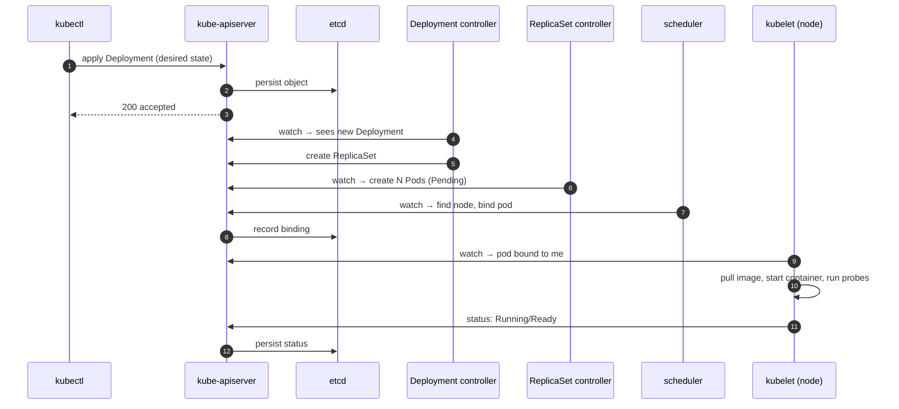

> Note there is no central orchestrator issuing commands. Every component
> **watches** the API server and reconciles independently. That's the level-
> triggered controller pattern the whole platform is built on.

---

## 10. Monitoring / metrics pipeline

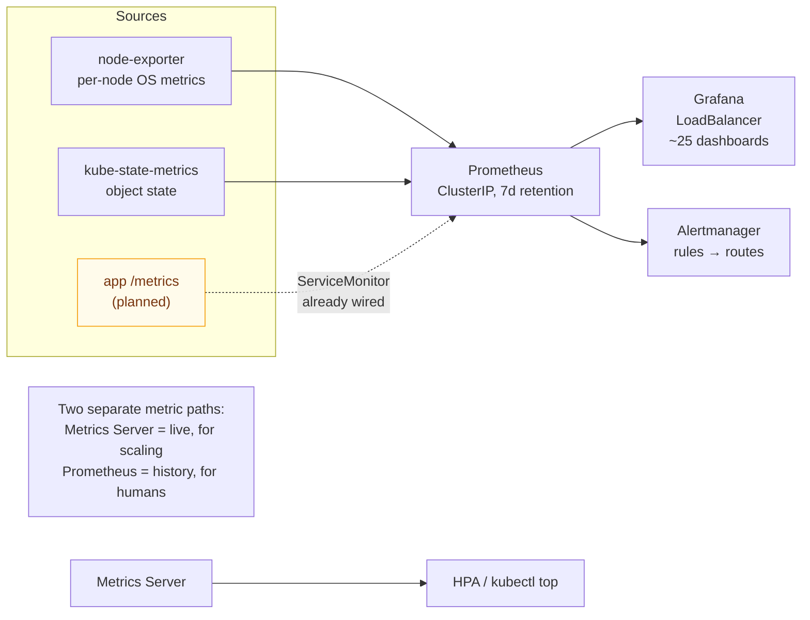

---

## 11. Ingress & load-balancer routing

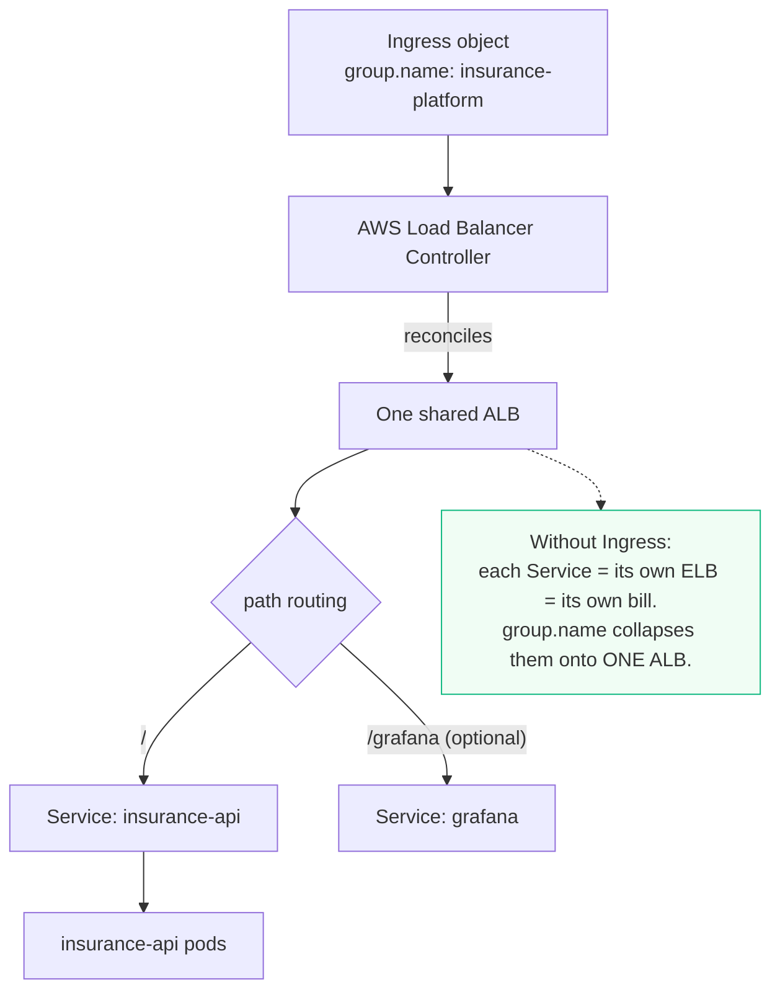

---

## 12. Service networking

How a name becomes a pod, with no pod IP ever hardcoded.

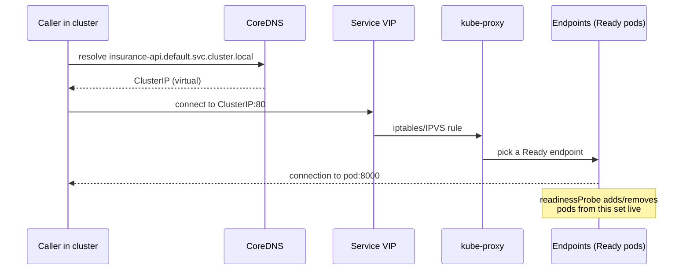

---

## 13. Velero backup flow

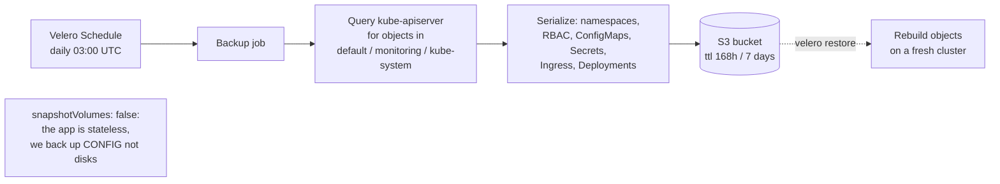

---

## 14. CI/CD pipeline

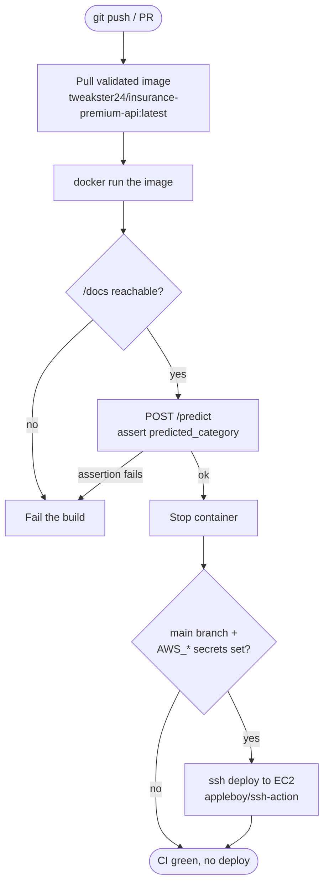

> The pipeline never *builds* the app image. It consumes the **validated**
> `tweakster24` image and gates deployment on a real prediction succeeding.
