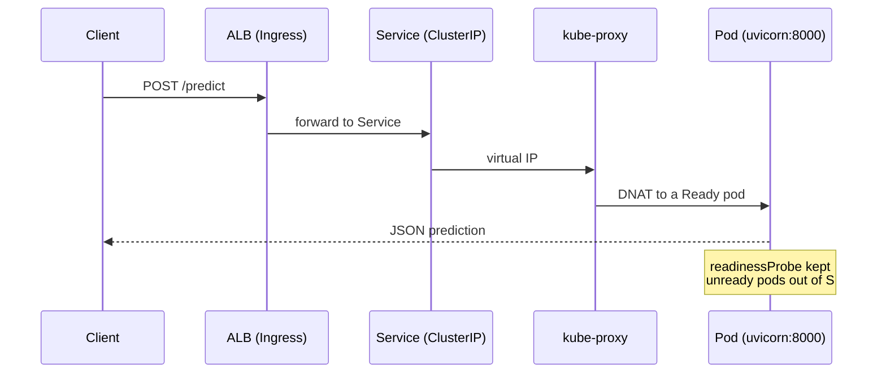

# Kubernetes objects & cluster components — what they are and *why* they exist

A reference to every Kubernetes object and cluster component this platform relies
on. For each one, three things: **What it is**, **Why it exists** (the specific
failure it prevents), and **How it's used here** (grounded in the real manifests,
not the textbook).

The ordering is deliberate — it starts at the workload the user actually cares
about and works outward to the machinery that keeps that workload alive.

---

## Part 1 — Workload objects

### Container
**What:** The running process — here, `uvicorn` serving the FastAPI app on port
8000, from the image `tweakster24/insurance-premium-api:latest`.
**Why:** A container ships the app with its exact dependencies (scikit-learn 1.6,
the pinned model) so it behaves identically on a laptop, on EC2, and on EKS. It
is what retires "works on my machine."
**Here:** One container per pod; probes hit its `/health` on 8000. The image is
immutable — the model is baked in, so there is no "load the right model" step at
runtime and no drift between what was tested and what runs.

### Pod
**What:** The smallest deployable unit — one or more containers sharing a network
namespace and IP.
**Why:** Kubernetes never schedules a bare container; it schedules pods. The pod
is the unit the scheduler places, the kubelet health-checks, and the Service
load-balances across.
**Here:** Each pod runs a single API container. Pods are **ephemeral** — a
reschedule hands out a new IP — which is exactly why nothing in this platform
addresses a pod directly (see Service).

### ReplicaSet
**What:** A controller that keeps *N* identical pods running.
**Why:** Pods do not self-heal. When a pod (or the node under it) dies, something
must notice and recreate it. The ReplicaSet is that reconciler for a fixed count.
**Here:** You never author a ReplicaSet by hand — the Deployment creates and owns
one for you. Each rollout produces a **new** ReplicaSet, and that is precisely the
mechanism rollback rides on (see Deployment).

### Deployment
**What:** The declarative controller over ReplicaSets that manages rollouts and
rollbacks.
**Why:** You want to declare "run this version, 2 replicas, roll updates one at a
time, and let me undo a bad release" and have the system honour it. A Deployment
supplies rolling updates, revision history, and `kubectl rollout undo`.
**Here:** [`k8s/base/deployment.yaml`](../../k8s/base/deployment.yaml).
`replicas: 2` (the availability floor), `maxUnavailable: 0 / maxSurge: 1` (never
dip below capacity mid-rollout), three probes, and right-sized requests.

### Service
**What:** A stable virtual IP + DNS name that load-balances across the pods
matching its label selector.
**Why:** Pods are ephemeral and their IPs move. Clients need one address that
doesn't. The Service is that stable front door; kube-proxy spreads traffic across
the currently-Ready pods only.
**Here:** [`k8s/base/service.yaml`](../../k8s/base/service.yaml) — `ClusterIP`,
port 80 → targetPort 8000. Internal on purpose; the public edge is the Ingress.

**Service types, and why ClusterIP + Ingress here:**
- **ClusterIP** (default): internal-only stable IP. Used here for the API.
- **NodePort**: opens a high port on *every* node. Fine for a demo; ugly in prod
  (raw ports, no L7, no TLS).
- **LoadBalancer**: provisions a *dedicated cloud load balancer per Service* —
  N services means N ELBs and N bills. Used here only for Grafana (a single
  human-facing dashboard), and even that can move behind the shared ALB.

### Namespace
**What:** A virtual cluster-within-the-cluster for grouping and isolating objects.
**Why:** It scopes names, RBAC, quotas, and network policy. It is how you keep
`monitoring` walled off from your app in `default`, and how you grant a team
access to only their slice of the cluster.
**Here:** `default` (app), `monitoring` (Prometheus/Grafana), `kube-system`
(controllers), `velero`, `goldilocks`.

### ConfigMap & Secret
**What:** ConfigMap holds non-sensitive config; Secret holds sensitive values
(base64-encoded, ideally encrypted at rest).
**Why:** Configuration belongs *outside* the image so one immutable image runs in
dev/stage/prod with different settings. Secrets keep credentials out of code so
they can be rotated and access-controlled independently.
**Here:** The app is configuration-light (model baked in), so there is no
hand-written ConfigMap yet; Grafana's admin password is the first value that
should move from a Helm value into a Secret (see
[../security/README.md](../security/README.md)).

---

## Part 2 — Scaling objects

### HorizontalPodAutoscaler (HPA)
**What:** Scales the *number* of pods based on a metric.
**Why:** Traffic is spiky. A fixed replica count wastes money at idle and drops
requests at peak. The HPA adds and removes pods to track load.
**Here:** [`k8s/autoscaling/hpa.yaml`](../../k8s/autoscaling/hpa.yaml) — CPU
target 50% of request, min 2 / max 10. A slow scale-down (5-min window) prevents
flapping; a fast scale-up absorbs bursts.

### VerticalPodAutoscaler (VPA)
**What:** Recommends (or sets) the *size* of each pod — its CPU/memory requests.
**Why:** You cannot derive the right request from the node spec; it depends on
the app's real behaviour. The VPA measures usage and recommends.
**Here:** [`k8s/autoscaling/vpa.yaml`](../../k8s/autoscaling/vpa.yaml) in
`updateMode: "Off"` — **recommend-only, on purpose**: HPA and VPA must not both
act on CPU, or they fight each other. The VPA advises; a human applies the
recommendation at deploy time.

### Cluster Autoscaler
**What:** Scales the *number of nodes* (EC2 instances) in the node group.
**Why:** The HPA can request an 11th pod, but if every node is full it sits
`Pending` forever. The Cluster Autoscaler watches for unschedulable pods and adds
a node; it removes idle nodes to hold cost down.
**Here:**
[`k8s/autoscaling/cluster-autoscaler-values.yaml`](../../k8s/autoscaling/cluster-autoscaler-values.yaml)
— `least-waste` expander, 5-min scale-down, IRSA-scoped IAM. It matters because a
`t3.small` tops out near 11 pods (ENI/IP limit), so pod pressure becomes node
pressure faster than you'd expect.

**The three-layer scaling story:** HPA (how many pods) → Cluster Autoscaler (are
there machines for them) → VPA (how big should each pod be). Three different
questions, three controllers, deliberately non-overlapping.

---

## Part 3 — Networking

### Ingress
**What:** An L7 (HTTP) routing object — host/path rules pointing at Services.
**Why:** Without it, each externally-exposed Service needs its own cloud load
balancer. Ingress consolidates: one load balancer, routing by path, with TLS and
host rules a raw ELB can't express.
**Here:** [`k8s/ingress/ingress.yaml`](../../k8s/ingress/ingress.yaml) →
`group.name: insurance-platform`, so a single ALB is shared. It **reduces the
number of load balancers**; it does not replace the load-balancer concept.

### AWS Load Balancer Controller
**What:** The controller that turns an Ingress object into a real AWS ALB.
**Why:** An Ingress is inert on its own — something must reconcile it into cloud
infrastructure. This controller does, via IRSA-scoped permissions.
**Here:**
[`k8s/ingress/aws-load-balancer-controller-values.yaml`](../../k8s/ingress/aws-load-balancer-controller-values.yaml).

### kube-proxy
**What:** The node component that implements Service virtual IPs (via iptables/
IPVS rules).
**Why:** A Service IP is not a real interface — kube-proxy programs each node so
traffic to the ClusterIP is DNAT'd to a Ready pod.
**Here:** Runs as a DaemonSet on every node; you rarely touch it, but it is the
reason `ClusterIP` works at all.

### CoreDNS
**What:** In-cluster DNS.
**Why:** Services are addressed by name (`insurance-api.default.svc.cluster.
local`), not IP. CoreDNS resolves those names so config never hardcodes IPs.
**Here:** Cluster add-on; the Service's DNS name resolves through it.

---

## Part 4 — Control plane (AWS-managed on EKS)

On EKS you do not run these — AWS does, for ~\$0.10/hr — but you must understand
them to debug the cluster when it misbehaves.

### kube-apiserver
**What:** The front door to the cluster; every `kubectl` call and every
controller talks to it.
**Why:** It is the single source of truth and the only writer to etcd. All
coordination flows through it.

### etcd
**What:** The consistent key-value store holding all cluster state.
**Why:** It is the database of record — every object you `kubectl get` lives here.
Lose it and you lose the cluster, which is exactly why Velero backs up the
*objects*.

### kube-scheduler
**What:** Decides which node each new pod runs on.
**Why:** Placement is not trivial — it must respect requests, node capacity,
affinity, and taints. The scheduler filters feasible nodes and scores them.
**Here:** Bin-packs API pods onto the two `t3.small` nodes by their CPU/memory
*requests* — which is exactly why right-sizing those requests matters.

### kube-controller-manager
**What:** Runs the built-in controllers (ReplicaSet, node, endpoints, …) that
drive actual state toward desired state.
**Why:** Kubernetes is a set of reconcile loops; this is where most of them live.

### Metrics Server
**What:** Cluster-wide CPU/memory metrics aggregator (`metrics.k8s.io`).
**Why:** The HPA and `kubectl top` need *live* resource numbers. Metrics Server
provides them (it keeps no history — that is Prometheus's job).
**Here:** Feeds the HPA's CPU-utilization decision.

---

## How they fit together (one request, end to end)

See [docs/diagrams/](../diagrams/) for the autoscaling-decision, scheduling, and
control-plane-interaction diagrams.
