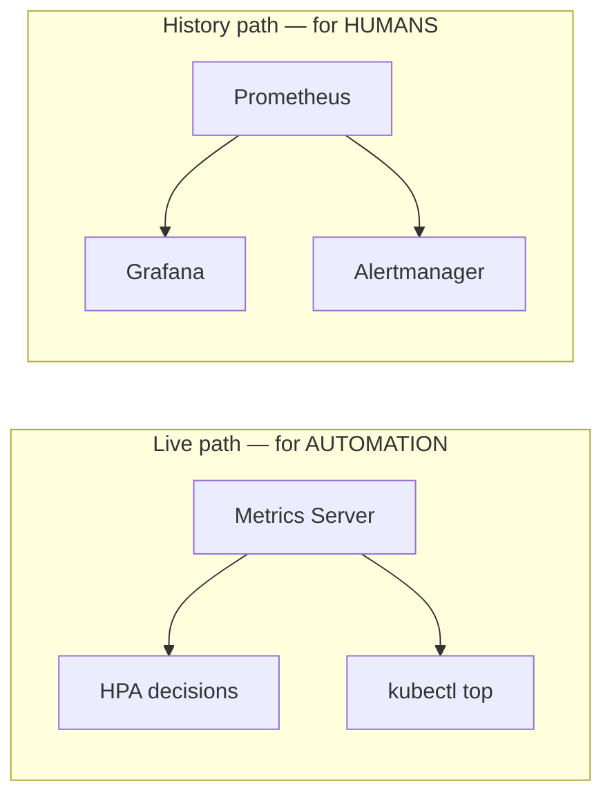
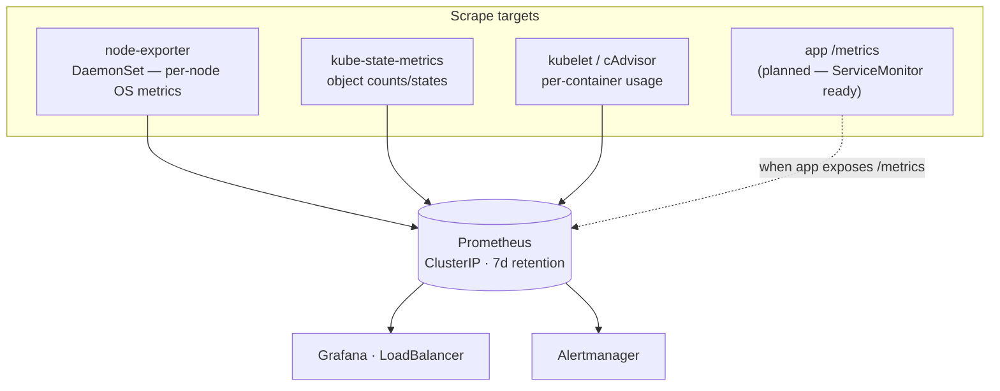

# Monitoring & observability

How the platform is observed, why each piece exists, and — importantly — the two
*separate* metric paths that people routinely confuse.

---

## The two metric paths (read this first)



- **Metrics Server** — a lightweight, *in-memory, no-history* aggregator of live
  CPU/memory. It exists so the **HPA** and `kubectl top` have current numbers.
  It is **not** a monitoring system.
- **Prometheus** — a full time-series database that **scrapes and stores**
  history, so humans can chart trends, and alerts can fire on them.

They are not redundant — you need both. The HPA can't query Prometheus fast
enough for scaling; Prometheus keeps the history Metrics Server throws away.

---

## Prometheus architecture

Installed via `kube-prometheus-stack`
([values](../../k8s/observability/kube-prometheus-stack-values.yaml)).



- **ClusterIP, on purpose:** Prometheus is queried in-cluster (by Grafana); there
  is no reason to expose it publicly.
- **7-day retention:** enough to spot trends on a demo cluster without unbounded
  storage. Production would ship to long-term storage (Thanos/Cortex).
- **ServiceMonitor:** the CRD that tells Prometheus *what* to scrape. Ours
  ([servicemonitor.yaml](../../k8s/observability/servicemonitor.yaml)) already
  targets the app's `http` port `/metrics` — it activates the moment the app
  exposes that endpoint.

---

## Grafana

- **LoadBalancer** (or behind the shared ALB) — it's the human-facing view, so
  it gets an address.
- **~25 dashboards** ship with the stack (`defaultDashboardsEnabled: true`):
  cluster CPU/memory, node health, pod resource usage, API-server latency,
  workload states.
- **Credentials:** `admin` / `admin123` today — explicitly flagged for hardening
  in [../security/](../security/) before any public exposure.

Access without exposing it publicly:
```bash
kubectl -n monitoring port-forward svc/monitoring-grafana 3000:80
```

---

## What we can and can't see today (honest scope)

| Signal | Available? | Source |
|---|---|---|
| Node CPU/mem/disk | ✅ | node-exporter |
| Pod/container CPU/mem | ✅ | kubelet/cAdvisor |
| Object states (deploys, pods, HPA) | ✅ | kube-state-metrics |
| Control-plane / API-server metrics | ✅ | kube-prometheus-stack |
| **App request rate / latency / errors** | ⏳ **not yet** | needs app `/metrics` |

The gap is deliberate and disclosed: the app doesn't yet expose `/metrics`. The
`ServiceMonitor` is already wired, so closing the gap is an app change, not a
platform change.

---

## Alerting

`kube-prometheus-stack` ships Alertmanager with default rules (node down, pod
crash-looping, high memory, etc.). To make it actionable:

```bash
# Inspect active alerts
kubectl -n monitoring port-forward svc/alertmanager-operated 9093:9093
# open http://localhost:9093
```

**Backlog:** route Alertmanager to a real receiver (Slack/email/PagerDuty) and
add an app-latency SLO alert once `/metrics` exists. Until then, alerting covers
infrastructure health, not application SLOs.

---

## First-response monitoring commands

```bash
kubectl top nodes ; kubectl top pods            # live pressure
kubectl -n monitoring get pods                  # is the stack itself healthy?
kubectl -n monitoring port-forward svc/prometheus-operated 9090:9090
#   → http://localhost:9090/targets   (who's UP/DOWN and why)
```
