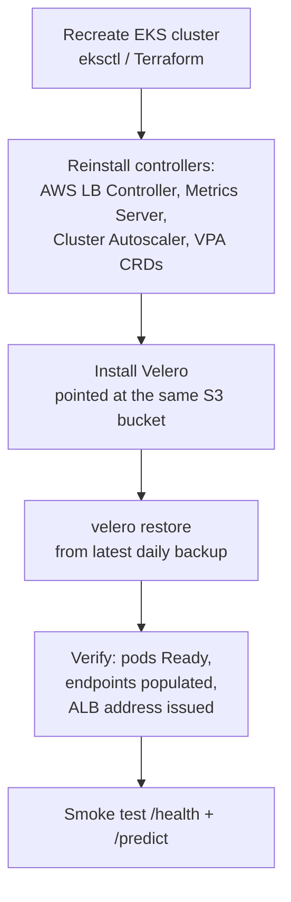

# Operations

Running the platform day to day: routine health checks, backups, restore, and
disaster recovery. The goal is that nothing here requires re-deriving how the
system works during an incident — it's all written down.

---

## Health-check cadence

### Daily (2 minutes)
```bash
kubectl get nodes                        # all Ready?
kubectl get pods -A | grep -vE 'Running|Completed'   # anything unhealthy?
kubectl get hpa insurance-api            # replicas sane, TARGETS not <unknown>?
kubectl top nodes                        # any node near capacity?
```
Glance at the Grafana cluster dashboard for latency/error-rate anomalies.

### Weekly (15 minutes)
```bash
kubectl top pods --containers            # drift vs requests → check VPA/Goldilocks
kubectl get events -A --field-selector type=Warning --sort-by=.lastTimestamp
kubectl get deploy -A                    # any stuck rollouts?
velero backup get                        # last 7 backups Completed?
```
Open **Goldilocks** and compare its recommendations to current requests; if
they've drifted materially, plan a request update at the next deploy.

### Monthly (30–60 minutes)
- Review HPA behaviour over the month (max replicas hit? flapping?).
- **Test a restore** (below) into a scratch namespace — an untested backup is a
  hope, not a backup.
- Review IAM/IRSA roles for least privilege ([../security/](../security/)).
- Check for EKS control-plane / node-group version updates.
- Right-size: apply accumulated VPA recommendations.

---

## Backups (Velero)

Backups run automatically via the Schedule in
[`k8s/backup/velero-schedule.yaml`](../../k8s/backup/velero-schedule.yaml) —
daily 03:00 UTC, 7-day retention, `default` + `monitoring` + `kube-system`.

```bash
velero schedule get
velero backup get
velero backup describe <backup-name>
velero backup create manual-$(date +%s) \
  --include-namespaces default,monitoring    # ad-hoc before a risky change
```

**What's backed up:** cluster *objects* (namespaces, RBAC, ConfigMaps, Secrets,
Ingress, Deployments) — not volumes (`snapshotVolumes: false`), because the app
is stateless. We back up the *configuration*, not disks.

---

## Restore

```bash
velero restore create --from-backup <backup-name>
velero restore describe <restore-name>
velero restore logs <restore-name>
```

**Test restores into an isolated namespace** so you never overwrite live objects:
```bash
velero restore create test-restore --from-backup <backup-name> \
  --namespace-mappings default:restore-test
kubectl get all -n restore-test
kubectl delete ns restore-test           # clean up after verifying
```

---

## Disaster recovery — full cluster loss

If the cluster is gone, the recovery order is:



**RPO** (data loss window): ≤ 24h for cluster config (daily backups). The app
itself is stateless, so there's no application data to lose — only configuration.
**RTO** (time to recover): dominated by cluster + controller reinstall; the
Velero restore itself is minutes.

> The single dependency that makes this work: the Velero S3 bucket must survive
> the cluster. It lives outside the cluster by design, in a separate failure
> domain.

---

## Routine changes without downtime

| Task | Command | Why it's safe |
|---|---|---|
| Deploy new version | `kubectl set image ...` | `maxUnavailable: 0` keeps capacity |
| Bump replicas floor | `kubectl patch hpa ...` | HPA stays in control |
| Drain a node for maintenance | `kubectl drain <node> --ignore-daemonsets` | Pods reschedule; `replicas: 2` spread survives it |
| Apply VPA recommendation | edit requests, redeploy | Rolling update, no dip |

---

## Cost hygiene (this is a demo/learn cluster)

The EKS control plane (~\$0.10/hr) and any ALB/ELB bill continuously. When not in
use, tear the cluster down completely:

```bash
eksctl delete cluster --name insurance-cluster --region us-east-1
```

Verify afterward that ELBs and node-group EC2 instances are actually gone (a
lingering LoadBalancer Service can leave an orphaned ELB billing after cluster
deletion — check the EC2 console).
