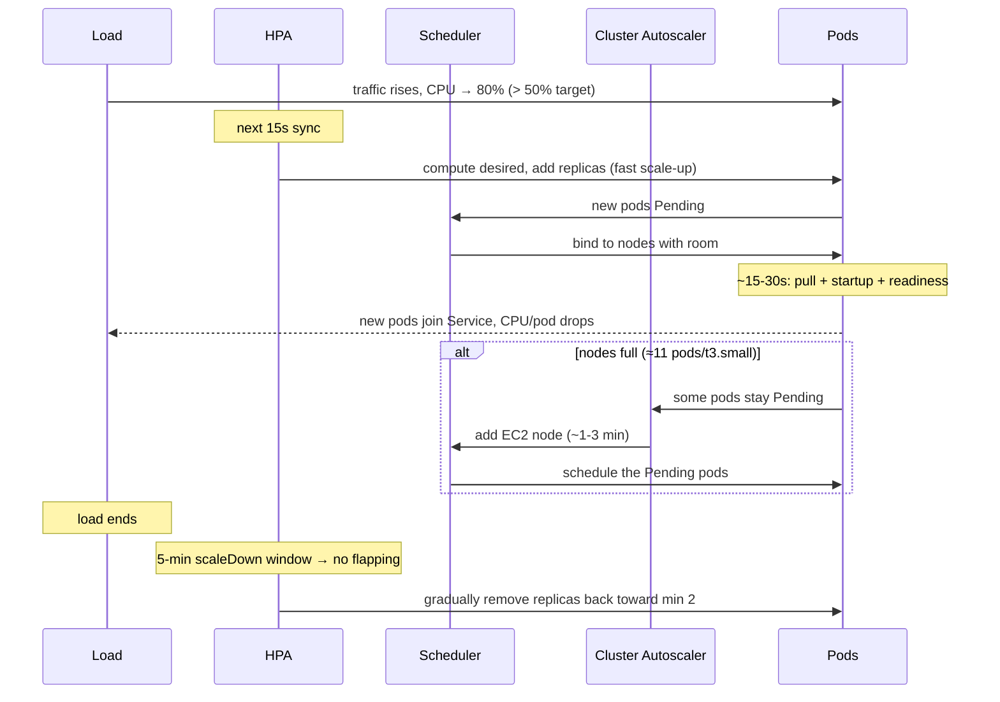
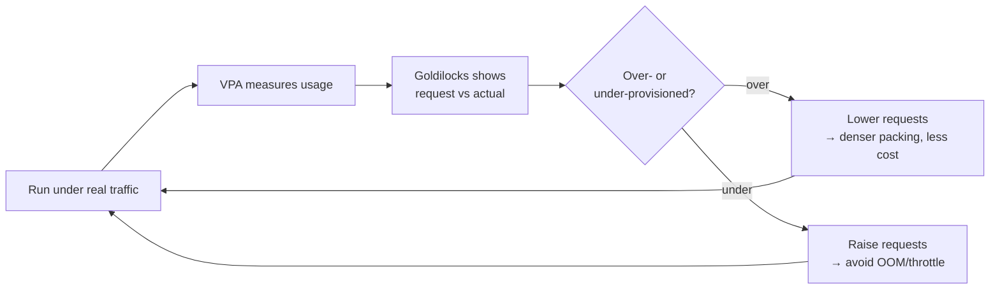

# Performance & autoscaling behaviour

How the platform behaves under load, how the numbers in the manifests were
arrived at, and what a scale-out actually looks like over time.

---

## How to generate load

Any HTTP load generator works. A minimal in-cluster loop against the Service:

```bash
# Fire continuous predictions from inside the cluster (uses the shared image)
kubectl run loadgen --rm -it --image=williamyeh/hey --restart=Never -- \
  -z 5m -c 50 -m POST \
  -H 'Content-Type: application/json' \
  -d '{"age":40,"weight":72,"height":1.75,"income_lpa":12,"smoker":false,"city":"Mumbai","occupation":"private_job"}' \
  http://insurance-api.default.svc.cluster.local/predict
```

Watch the system react in three other terminals:
```bash
kubectl get hpa insurance-api -w          # TARGETS % and replica count
kubectl get pods -w                       # pods appearing / going Ready
kubectl top pods                          # per-pod CPU vs the 50% target
```

---

## What a scale-out looks like (timeline)



**Key latencies to expect:**
- HPA reaction: within one **15s** sync after CPU crosses target.
- New pod Ready: **~15-30s** (image cached), which is why the target is 50%, not 90%.
- New **node** via Cluster Autoscaler: **~1-3 min** (EC2 launch + join).
- Scale-down: deliberately slow (**5-min** stabilization) to avoid thrashing.

---

## How the resource numbers were derived

Nothing here was guessed. The flow was **measure → recommend → set**:

1. Deploy with generous initial requests.
2. Drive real traffic (above).
3. Read **VPA** recommendations, visualized in **Goldilocks**.
4. Set requests to the recommendation: `cpu 25m` (idle is far below this),
   `memory 256Mi` (the real constraint), with `memory limit == request` for
   Guaranteed QoS.

This is the whole reason VPA + Goldilocks exist in the stack. See
[../kubernetes/DESIGN_DECISIONS.md](../kubernetes/DESIGN_DECISIONS.md).

---

## The pod-density ceiling (why max is 10)

A `t3.small` supports roughly **11 pods** (an ENI/IP-per-node limit, not CPU or
memory). With 2 nodes that's ~22 pod slots, shared with the monitoring stack.
Consequences baked into the design:

- HPA `maxReplicas: 10` gives realistic headroom without assuming infinite nodes.
- Cluster Autoscaler is **required**, not optional. It's what turns "the 11th
  pod is Pending" into "add a node."
- A CPU-bound production workload would move to larger instances; here the low
  ceiling is a documented teaching constraint, not a hidden surprise.

---

## Resource-optimization loop (ongoing)



Right-sizing is never "done." It's a loop you re-run whenever the model, the
traffic shape, or the instance type changes.
