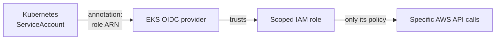

# Security

The security posture of the platform, split honestly into **what's implemented**
and **what's deliberately deferred** (with the fix for each). A demo/learn
cluster that pretends to be hardened is worse than one that's honest about its
gaps, so this document names them.

---

## IAM & IRSA: least privilege for pods

**IRSA (IAM Roles for Service Accounts)** is how a pod gets AWS permissions
*without* node-wide credentials. The chain:

Why it matters: the alternative is attaching a broad policy to the **node**,
which every pod on that node inherits. IRSA scopes permissions to *one*
ServiceAccount, so the AWS LB Controller can touch ELBs but nothing else, and the
Cluster Autoscaler can touch the ASG but nothing else.

Components here that use IRSA (role ARNs are `<ACCOUNT_ID>` placeholders in the
Helm values, by design, because they're environment-specific):

| Component | Needs | Values file |
|---|---|---|
| AWS Load Balancer Controller | Manage ALBs/target groups | [aws-load-balancer-controller-values.yaml](../../k8s/ingress/aws-load-balancer-controller-values.yaml) |
| Cluster Autoscaler | Adjust the node-group ASG | [cluster-autoscaler-values.yaml](../../k8s/autoscaling/cluster-autoscaler-values.yaml) |
| Velero | Read/write the backup S3 bucket | [velero-schedule.yaml](../../k8s/backup/velero-schedule.yaml) |

**Principle:** each role's policy should grant only the specific actions that
component needs, not `*`. Review these monthly (see [../operations/](../operations/)).

---

## RBAC: least privilege for humans & controllers

Kubernetes RBAC governs who/what can call the API. Guidance for this platform:

- Operators get a namespaced Role in `default` for day-to-day work, not
  `cluster-admin`.
- Controllers run under their own ServiceAccounts with only the verbs they need.
- Prefer `Role`/`RoleBinding` (namespaced) over `ClusterRole` wherever the scope
  allows it.

---

## Container hardening

Implemented in [`k8s/base/deployment.yaml`](../../k8s/base/deployment.yaml):

| Control | Setting | Why |
|---|---|---|
| No privilege escalation | `allowPrivilegeEscalation: false` | A compromised process can't gain more than it started with |
| Drop all capabilities | `capabilities.drop: ["ALL"]` | Remove every Linux capability the app doesn't need |
| Resource limits | `limits.cpu/memory` set | A runaway container can't starve its node |

**Deferred (named honestly):**
- `runAsNonRoot: true` + a non-root base image. The current validated image runs
  as **root**, so this is a known gap, fixed by rebuilding the image on a non-root
  base and flipping the flag.
- `readOnlyRootFilesystem: true`, added once the app's writable paths are confirmed.

---

## Secrets

| Item | Status | Fix |
|---|---|---|
| Grafana admin password | ⚠️ `admin123` as a Helm **value** | Move to a Kubernetes Secret (or AWS Secrets Manager via the CSI driver); rotate |
| App config | No hand-written Secret yet | The model is baked into the image; when app secrets appear, use `Secret` + IRSA, never env in plain manifests |
| etcd encryption at rest | EKS default | Confirm envelope encryption with a KMS key is enabled on the cluster |

**Rule enforced in this repo:** no real credential is committed. The AWS deploy
uses GitHub Actions **secrets** (`AWS_HOST`, `AWS_SSH_KEY`, `AWS_USER`), not
inline values.

---

## Network isolation

- **Prometheus is `ClusterIP`**, never exposed; only Grafana (the human view)
  gets an address.
- **Ingress consolidates the edge** onto one ALB, so there's a single, auditable
  entry point instead of many per-Service ELBs.
- **Backlog:** add `NetworkPolicy` to default-deny pod-to-pod traffic and allow
  only the flows that exist (client→api, prometheus→targets). Not yet applied.

---

## Image trust & supply chain

- The platform pins **one validated image**,
  `tweakster24/insurance-premium-api:latest`, used identically everywhere. Pinning
  a single known-good image removes "which image is prod?" drift.
- **CI gates on behaviour**, not just a build succeeding: it runs the image and
  asserts a real `/predict` response before any deploy
  ([deploy.yml](../../.github/workflows/deploy.yml)).
- **Backlog:** pin by immutable **digest** (`@sha256:…`) instead of `:latest`, and
  add image scanning (Trivy) + signing (cosign) in CI.

---

## Security backlog, consolidated

1. Non-root image + `runAsNonRoot` + `readOnlyRootFilesystem`.
2. Grafana password → Secret; put Grafana behind auth.
3. Pin image by digest; add Trivy scan + cosign signing in CI.
4. `NetworkPolicy` default-deny with explicit allows.
5. Tighten each IRSA policy to specific actions/resources; audit monthly.
6. Confirm etcd KMS encryption at rest on the cluster.

None of these are hidden; they're the honest gap between "works and is
reasonably hardened" and "production-grade," and each has a concrete next step.
